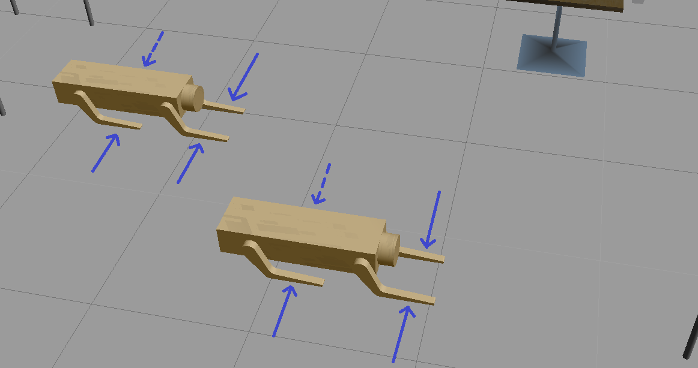
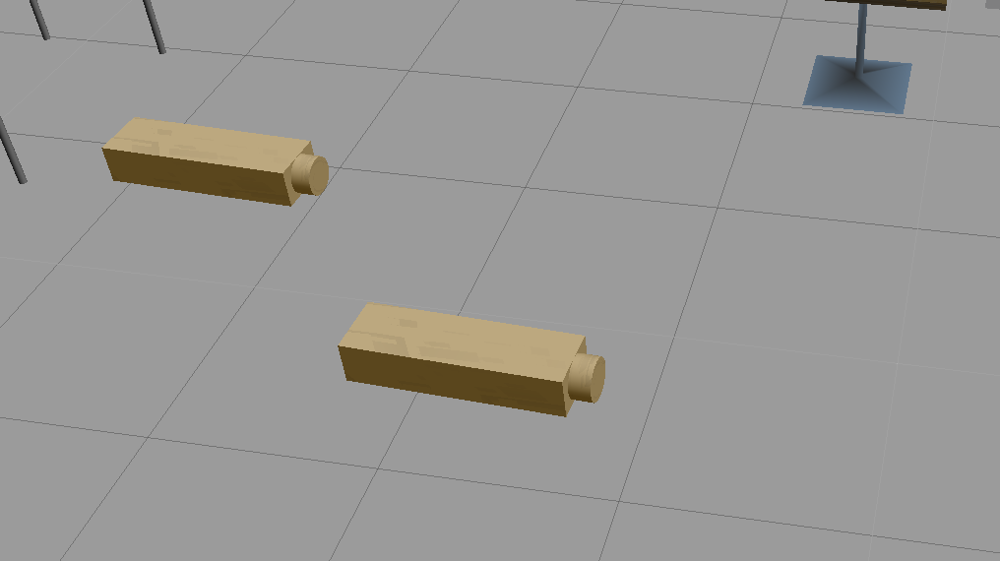

### Robotics Software Engineer - Nanodegree

# Project 02 (of 05) : Go Chase It
## Directory Structure

```
  .Go_Chase_It                         # Go Chase It Project
    ├── my_robot                       # my_robot package                   
    │   ├── launch                     # launch folder for launch files   
    │   │   ├── robot_description.launch
    │   │   ├── world.launch
    │   ├── meshes                     # meshes folder for sensors
    │   │   ├── hokuyo.dae
    │   │   ├── RoboLeg.STL            # CAD file of Robot's leg (made in SolidWorks)
    │   ├── urdf                       # urdf folder for xarco files
    │   │   ├── my_robot.gazebo
    │   │   ├── my_robot.xacro
    │   ├── world                      # world folder for world files
    │   │   ├── Avadhoot.world
    │   ├── CMakeLists.txt             # compiler instructions
    │   ├── package.xml                # package info
    ├── ball_chaser                    # ball_chaser package                   
    │   ├── launch                     # launch folder for launch files   
    │   │   ├── ball_chaser.launch
    │   ├── src                        # source folder for C++ scripts
    │   │   ├── drive_bot.cpp
    │   │   ├── process_images.cpp
    │   ├── srv                        # service folder for ROS services
    │   │   ├── DriveToTarget.srv
    │   ├── CMakeLists.txt             # compiler instructions
    │   ├── package.xml                # package info                  
    ├── output                         # screenshots and gif of output
    │   ├── GIF.gif                    
    │   ├── output.png
    │   ├── Reference_roboleg.png
    ├── README.md 
    ├── LICENSE
    └──   
```
## Project Goals
Designing a differential drive robot with the Unified Robot Description Format. Add two sensors to your robot: a lidar and a camera.

Writing a drive_botC++ node that will provide a service to drive the robot by controlling its linear x and angular z velocities.

A process_image C++ node that reads robot’s camera image, analyzes it to determine the presence and position of a white ball. If a white ball exists in the image, the node should request a service via a client to drive the robot towards it.

## Output


## Setup and run
Note: The commands in this README work, considering that the main workspace is located at ```/home/robond/workspace/catkin_ws/src```      
      Notice the ```robond``` username. Make appropriate changes for your system.
      
Warning: Some minor features will not work in your system if your username of the system is different.

[Click here for the fix and to learn more](#Missing-minor-feature)
#### 1. Update the Workspace image
```
$ sudo apt-get update && sudo apt-get upgrade -y 
```

#### 2. Clone the files in /home/workspace
```
$ cd /home/robond/workspace/catkin_ws/src
$ git clone https://github.com/Avadhoot94/Go_Chase_It.git
```
#### 3. Create a build directory and compile the code
```
$ cd /home/robond/workspace/catkin_ws
$ catkin_make
$ source devel/setup.bash
```

#### 3. Launch the world and the robot
```
$ roslaunch my_robot world.launch
```
Make sure the ```fixed frame``` in ```RViz``` is ```odom```

#### 4. Run ```drive_bot``` and ```process_image``` nodes
```
$ roslaunch ball_chaser ball_chaser.launch
```

#### 5. Visualize the output
Add camera in ```RViz``` and use the ```Image Topic``` : ```/camera/rgb/image_raw```

**OR**

```
$ rosrun rqt_image_view rqt_image_view
```


#### 6. Move the white ball
The ball is initially outside the building; can be seen at the bottom of the screen towards the middle

Control the white ball  using the ```move``` feature in Gazebo such that it falls within the camera frame.

Watch the robot chase the ball!

## Missing minor feature
The ```~/Go_Chase_It/my_robot/world/Avadhoot.world``` file uses ```~/Go_Chase_It/my_robot/meshes/RoboLeg.STL``` for the legs of the **static** robot model as indicated in the picture below:



<p>&nbsp;</p>

The ```Avadhoot.world``` file thus, contains the directory address of the ```RoboLeg.STL``` as ```/home/robond/workspace/catkin_ws/src/Go_Chase_It/my_robot/meshes/RoboLeg.STL```
&nbsp; &nbsp; &nbsp; &nbsp; &nbsp; &nbsp; &nbsp; &nbsp; &nbsp; &nbsp; &nbsp; &nbsp; &nbsp; &nbsp; &nbsp; &nbsp; &nbsp; &nbsp; &nbsp; &nbsp; &nbsp; &nbsp; &nbsp; &nbsp; &nbsp; &nbsp; &nbsp; &nbsp; &nbsp; &nbsp; &nbsp; &nbsp; &nbsp; &nbsp; &nbsp; &nbsp; &nbsp; &nbsp; &nbsp; &nbsp; &nbsp; &nbsp;     **Replace all** the addresses appropriately to see the legs. 

Else the package will **run without errors** but without the legs as seen below:


